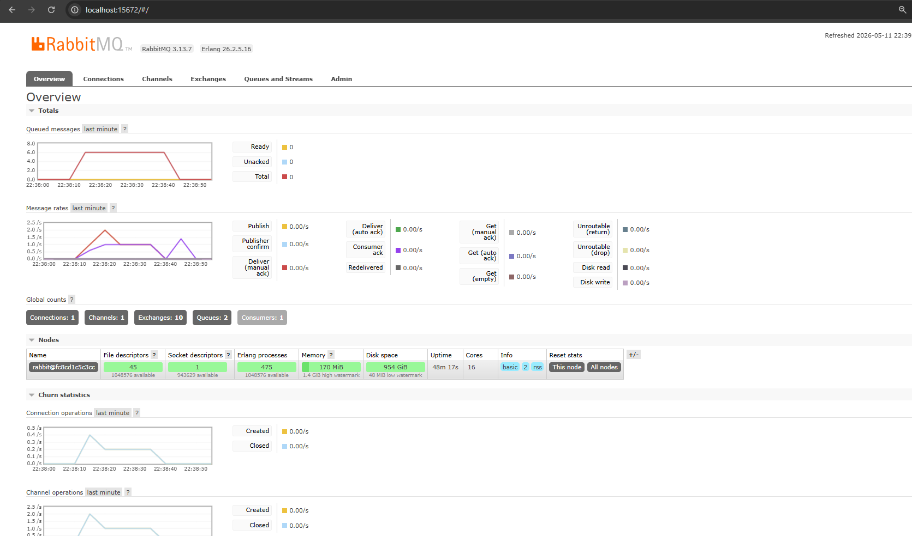

# Module 9 - Software Architecture (Subscriber)

1. What is amqp?
   AMQP stands for Advanced Message Queuing Protocol. AMQP is an open standard protocol used for message-oriented middleware. It acts as a specific set of communication rules and data formats for the publisher and subscriber. They use AMQP to talk to the message broker (RabbitMQ) to send, receive, and queue events.
2. What is guest:guest@localhost:5672?
   This string is a connection URL that provides the necessary credentials and location details for the code to connect to the RabbitMQ server. The first guest acts as the default username. The second guest is the default password. Localhost:5672 is the address of the message broker. This means RabbitMQ will locally run in port 5672 in our machine. 

------

My machine reached about 6 messages queued. This happens since I ran the publisher many times quickly, so it fires lots of messages into the broker. However, since the thread sleep (slow part) of the subscriber is activated, the connected consumer is only 1 at a time (seen from the global counts). This severely bottlenecks the system, as it only processes one message per second. This means the subscriber (consumer) can't read all the messages at once, the remaming unread messages are held in the queue. Since the publisher always publishes, the message sent is piled up in the queue. The flat top on the second graph shows that the subcriber only processes one message per second. 

